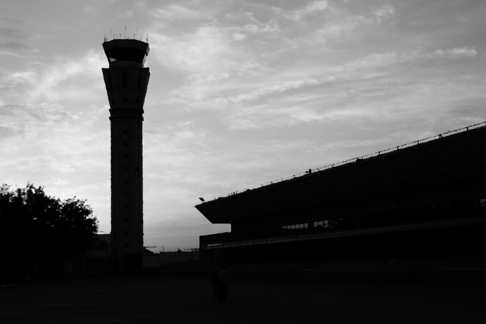
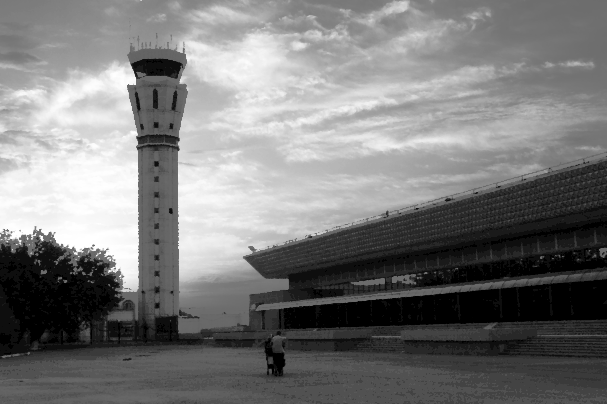

# Assignment 1

_Student:_ Xiao Zhehao  
_Student Number:_ A0235422N

## Part 1

### 1.

To recover a similar image to that shown in the assigment, we need to apply a median blur to remove noise from the image, followed by employing the use of histogram equalisation to improve the contrast. 


</br><center>Figure 1: Original Image</center>

</br><center>Figure 2: Original Image Histogram</center>

A median blur is first applied as the image is extremely noisy, as seen in the image(Figure 1) above by the naked eye. Beyond just that, by looking at the histogram(Figure 2) above we identify an extremely high singular peak at value 255, which corresponds to the noise in the image. Hence, we need to apply a median blur to remove the noise from the image. We use a median filter instead of a box or gaussian filter as the intensity values of the noise pixels are extreme(255) and hence taking the average would result in a highly skewed average output pixel. Taking the median does not have this problem as unlike the mean, the median is not affected as much by outlier values.   


</br><center>Figure 3: Blurred Image Histogram</center>

After applying the median blur, the new histogram has values more spread out across the intensity spectrum as seen in the histogram(Figure 3) above. However, we still notice 2 distinct tightly clustered sets of values, near 0 and around intensity level 200. The intensities are not evenly distributed across the specturm and the result can be in the image(Figure 4) seen below, which has no noise but extremely poor contrast. 


</br><center>Figure 4: Blurred Image</center>

Hence, we use histogram equalisation to rectify this, by evenly distributing the intensity values along the intensity spectrum. The results are shown in the histogram(Figure 5) and image(Figure 6) below.


</br><center>Figure 5: Equalised Image Histogram</center>


</br><center>Figure 5: Equalised Image</center>

The reason we chose to apply median blur before histogram equalisation was that the noise pixels mentioned in paragraph 2 above would have affected the histogram equalisation and prevented the real pixels from being equally spread out. Hence the contrast would still have remained relatively poor. This is shown in the histograms(Figure 6) below.


</br><center>Figure 6: Reversed Implementation Histograms</center>

With the above steps, we have obtained a well contrasted image free of noise, similar to the one in the assignment.

### 2.
We will not be able to segment the person with the trolley from the 
background with simple thresholding. For simple thresholding to work, the foreground we are attempting to segment out must have a significant difference in intensity values from the background. This usually translates to a clear bimodal histogram distribution. 

Although we see some inkling of a bimodal distribution in the histogram(Figure 5) above, we see that the image with the cropped part removed(Figure 7) still has the same histogram distribution(Figure 8) below. Looking at the cropped part's histogram(Figure 9), it values do not distinctly seperate from the uncorrupted image or crop removed image in intensity. Hence, it is not possible to segment the person with the trolley from the background with simple thresholding.


</br><center>Figure 7: Crop Removed Image</center>


</br><center>Figure 8: Crop Removed Image Histogram</center>
```
*As we used a white mask to remove the cropped area we can ignore the high single peak at 255, also we can ignore the slight differences in histogram distribution as the image was put through an image editor.
```


</br><center>Figure 9: Cropped Image Histogram</center>

## Part 2
### 3.
